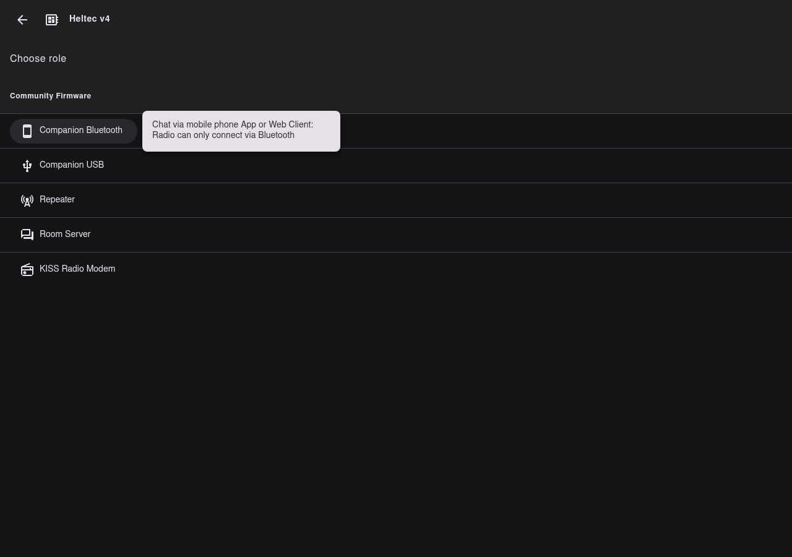

# Flash firmware

Use the MeshCore web flasher. Target for this walkthrough: **Heltec v4**. Role:
**Companion · Bluetooth**.

**Verified on this desk:** Companion BLE **v1.17.1**
(`heltec_v4_companion_radio_ble-v1.17.1-d929643-merged.bin`) written and hash-verified via
esptool on plain Heltec V4 (2MB PSRAM).

## Steps

1. Open [meshcore.io/flasher](https://meshcore.io/flasher) in **Chrome / Chromium / Edge**.
2. Device: **Heltec v4** (from [Identify](identify.md)).
3. Role: **Companion Bluetooth** (flasher role `companionBle`).
4. Enter [bootloader mode](bootloader.md) if the browser cannot open the serial port.
5. Flash the selected firmware (erase/wipe when doing a clean first install). Reselect the
   Espressif / `ttyACM*` port if prompted.
6. Wait until the flasher reports success. Tap **RST** if the board does not reboot on its own.

## Other roles (not this guide)

The same **Heltec v4** entry also lists Companion USB, Repeater, Room Server, and KISS.
This walkthrough only covers **Companion · Bluetooth** for phone pairing.

## Do not

- Flash Repeater or Room Server when you intend to pair a phone companion.
- Force a different Heltec target if **Heltec v4** is not your board.

Next: [First boot](first-boot.md).
