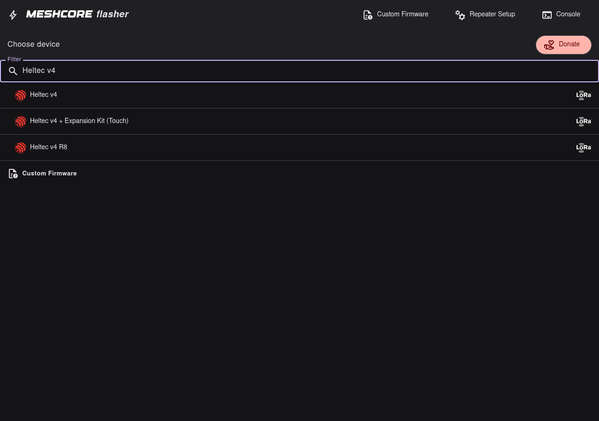

# Identify the board

Confirm you have a **Heltec WiFi LoRa 32 V4**, then pick that exact target in the MeshCore
flasher.

## Checks

1. Board silk / packaging says **WiFi LoRa 32 V4** (not V3 / Wireless Stick / T114).
2. USB shows Espressif JTAG/serial (`303a:1001`) when plugged in — see [Prerequisites](prerequisites.md).
3. In the flasher device list, choose **Heltec v4**.

## Flasher label

| Use this | Do not use for this guide |
| --- | --- |
| **Heltec v4** | Heltec v3, Heltec v2, Expansion Kit Touch variants, other makers |

This walkthrough assumes plain **Heltec v4**. If your board is a different MeshCore target,
stop and use the matching flasher entry instead of forcing these steps.

Next: [Bootloader mode](bootloader.md).
